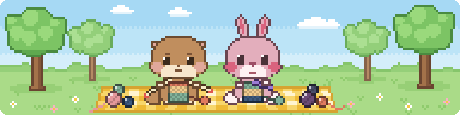
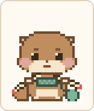
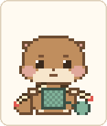
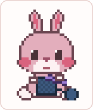
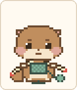
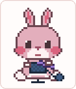
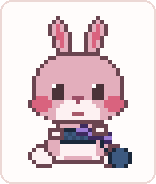
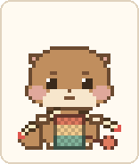
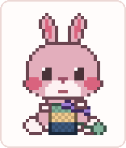

# 함뜨마을 동물 친구들

**한 단 한 단 같이 세어주는 픽셀 뜨개 친구들**

뜨개인 여러분, 한 단 한 단 종이에 체크하려니 번거롭지 않으셨나요? 
함뜨마을에서는 대바늘로 뜰 땐 단수달 🦦이, 코바늘로 뜰 땐 코토키 🐰가 옆에서 같이 떠요. 
같이 뜨면 절대 헷갈리지 않아요.

### 🧶 [지금 써보기 → ssurxiv.github.io/dansudal](https://ssurxiv.github.io/dansudal/)

## 🏡 함뜨마을 친구들을 소개해요

화면 맨 위 탭을 눌러 친구를 고르면 돼요. 진행 상황은 친구마다 따로
저장되니, 대바늘 작품과 코바늘 작품을 동시에 떠도 섞이지 않아요.

| | 단수달 🦦 | 코토키 🐰 |
| --- | --- | --- |
| **이름** | **단수** 세는 **수달** | **코**바늘 뜨는 **토끼** |
| **도구** | 대바늘 두 짝 | 코바늘 하나 |
| **성격** | 약간 과묵한 감자 같은 수달. 말수 적고 표정은 눈과 귀로 | 깨발랄 햇살 토끼. 발그레한 볼과 쫑긋한 귀 |
| **진행 칸** | 🐟 물고기 | 🥕 당근 |
| **완성품** | 🧣 목도리 | 🧢 비니 |

## ✨ 뭘 할 수 있나요?

| | 단수달 | 코토키 |
| --- | :---: | :---: |
| **🧶 한 단 떴어요** `Space` 단수가 하나 오르고, 들고 있는 편물이 조금씩 자라요. |  |  |
| **✂️ 한 단 풀기** `Backspace` 틀렸으면 방금 뜬 단을 되돌려요. 흠칫(!) 하고 바늘을 빼서 실을 당기면 풀린 실은 바닥에 쌓여요. |  |  |
| **🧵 실 감기** `W` 바닥에 쌓인 실은 다시 감아야 다음 단에 쓸 수 있어요. |  |  |
| **🎨 실 색 바꾸기** 실 창고에서 새 색을 고르면 그때부터 그 색으로 떠져요. 완성품에도 줄무늬로 남아요. |  |  |
| **✨ 완성 & 입어보기** 목표 단수를 채우면 반짝! 완성품을 자랑하고, 입어보기로 직접 둘러볼 수 있어요. |  |  |

그 밖에도,

- **🔔 알림**: "20단에서 코 줄임", "8단마다 꽈배기"처럼 특정 단이나
  N단마다(구간 지정 가능) 말풍선으로 알려줘요. 코 줄임·코 늘림·꽈배기
  알림이 걸린 단은 진행 칸에도 `^` `V` `X` 표시가 생겨요.
- **🔁 새로 뜨기**: 총 단수는 그대로 두고 진행 상황과 알림만 처음으로
  되돌려요.
- **+ / −**: 캐릭터를 크게 또는 작게 볼 수 있어요.

## 📋 화면 구성

| 요소 | 뜻 |
| --- | --- |
| 위쪽 탭 | 단수달 🦦 / 코토키 🐰 전환. 진행 상황은 친구마다 따로 저장돼요 |
| 진행 칸 | 한 칸이 한 단. 뜬 단은 그 단을 뜬 실 색으로 채워져요 |
| 뜬 단수/총 단수 | 지금까지 뜬 단수와 목표 단수. 총 단수는 실수로 바뀌지 않게 ✎를 눌러야 고칠 수 있어요 |
| 쓴 볼 수/보유 볼 수 | 다 쓴 실뭉치 수(−/+) / 갖고 있는 실뭉치 수(✎, 선택 입력) |

진행 상황은 이 브라우저에 자동으로 저장돼요. 다른 기기에서는 이어지지
않아요.

## 💡 왜 만들었나요?

뜨개질하다 단수를 놓치는 게 싫어서 만든 개인 프로젝트입니다. 그냥
숫자만 세는 카운터 앱이 아니라, 실이 늘고 줄고 다시 감기는 과정
전체가 하나의 캐릭터 애니메이션으로 이어지도록 만들었어요.

처음엔 대바늘을 뜨는 단수달 하나였는데, 코바늘 뜨는 분들도 같이 쓸 수
있게 두 번째 친구 코토키가 생겼어요. 그렇게 하나둘 모인 동물 친구들이
사는 곳이 함뜨마을이에요.

## 💬 피드백

써보시고 의견이나 추가됐으면 하는 기능이 있다면 인스타그램
[@tteoboja_0](https://instagram.com/tteoboja_0)로 편하게 DM 주세요!

## 🔖 저작권

© 2026 [@tteoboja_0](https://instagram.com/tteoboja_0). 무단 재배포
금지. 자세한 조건은 `LICENSE.txt` 참조.
